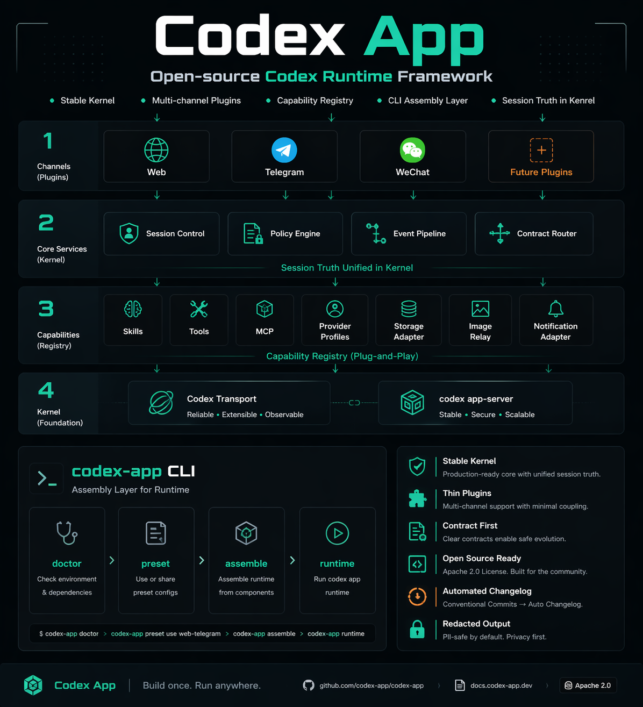

# Codex App

统一的 Codex 服务层仓库。

## 产品总览

## 入口

| 需要了解 | 读这个 |
|---------|--------|
| 项目状态 | `docs/project/status.md` |
| 快速启动 | `docs/project/getting-started.md` |
| 图谱总览 | `graphify-out/GRAPH_REPORT.md` |
| 目标架构 | `docs/architecture/README.md` |
| CLI 架构 | `docs/architecture/cli.md` |
| 重构路线图 | `docs/architecture/roadmap.md` |
| 版本/发布工作流 | `docs/workflows/versioning-and-release.md` |
| 仓库约束 | `AGENTS.md` |
