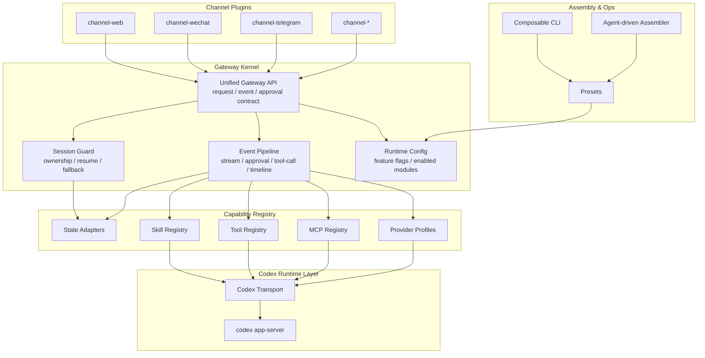
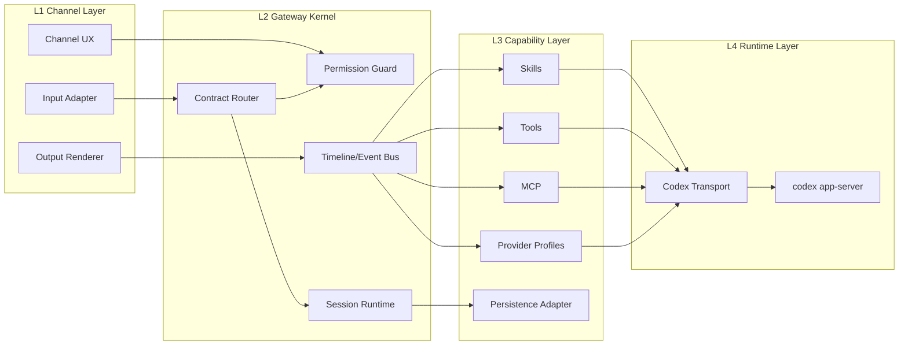
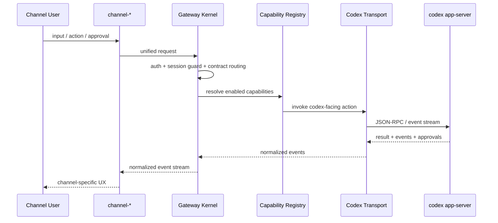
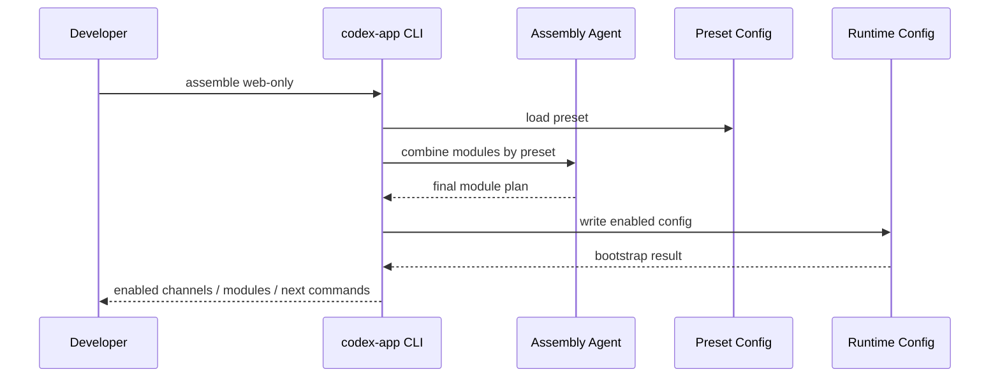

# Codex App 架构总览

这份目录描述的是 **目标方案**，不是当前实现。

设计目标：

- 同仓库模块化
- 按配置启用
- `web / wechat / telegram` 都视为 channel plugin
- 主文档只关心总架构和必要模块组合
- channel 细节单独下沉到 `channels/`
- CLI 可以基于 preset 与 agent 装配模块

## 文档导航

- [内核层](/Users/Bigo/Desktop/develop/nova-infra/codex-app/docs/architecture/kernel.md)
- [必要模块组合](/Users/Bigo/Desktop/develop/nova-infra/codex-app/docs/architecture/modules.md)
- [装配与 CLI](/Users/Bigo/Desktop/develop/nova-infra/codex-app/docs/architecture/composition.md)
- [CLI 架构](/Users/Bigo/Desktop/develop/nova-infra/codex-app/docs/architecture/cli.md)
- [重构路线图](/Users/Bigo/Desktop/develop/nova-infra/codex-app/docs/architecture/roadmap.md)
- [Channel 目录](/Users/Bigo/Desktop/develop/nova-infra/codex-app/docs/architecture/channels/README.md)

## 规划边界

- `architecture/` 是当前唯一保留的架构规划主线
- 历史验收、阶段 TODO、旧版总览图不再作为规划依据
- 推进顺序以 `roadmap.md` 为准，图谱用于辅助识别核心节点与拆分优先级

## 总体架构图

## 四层职责图

## 目标链路

### 主链路

### 装配链路

## 一句话结论

V2 不是“大一统中台”，而是：

**稳定内核 + 能力注册层 + 可装配 channel + preset 驱动 CLI**
