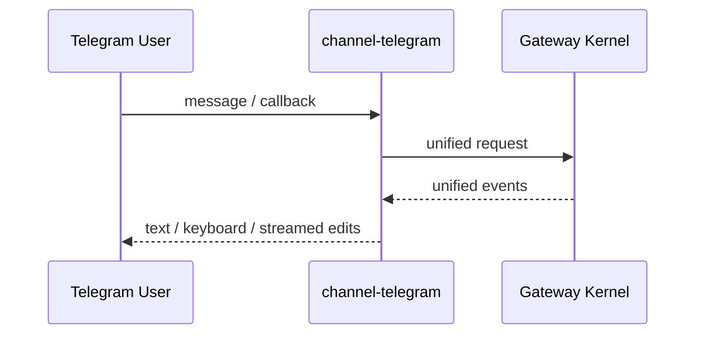

# channel-telegram

`telegram` 是可选 channel plugin，不进入主依赖闭环。

## 职责

- Bot API 输入适配
- inline keyboard / message edit 渲染
- 把 Telegram UX 映射到统一 contract

## 特有 UX

- inline keyboard approval
- 流式 editMessageText
- callback_query

## 不负责

- 不定义 tool-call 语义
- 不定义 session ownership 规则
- 不维护独立 provider/skill 真相

## Telegram 链路

