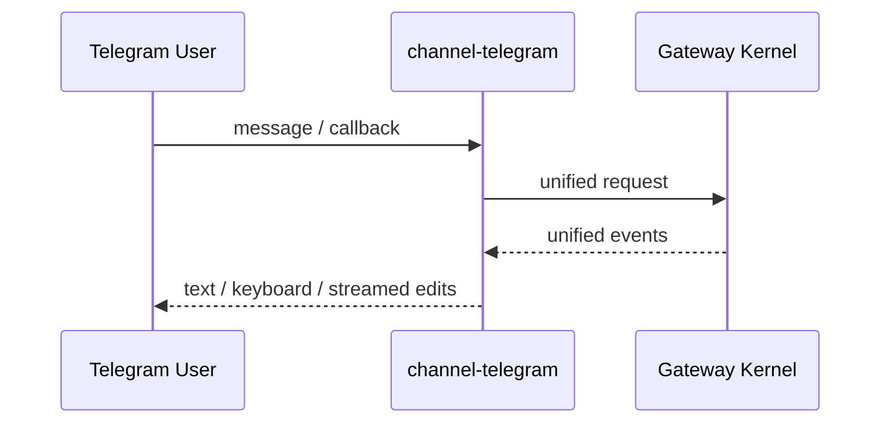

# channel-telegram

`telegram` 是可选 channel plugin，不进入主依赖闭环。

## 职责

- Bot API 输入适配
- inline keyboard / message edit 渲染
- 把 Telegram UX 映射到统一 contract

## 消息样式

Telegram 返回样式按 [消息样式规范](/Users/Bigo/Desktop/develop/nova-infra/codex-app/docs/architecture/channels/message-style.md) 的 Hermes high tier 执行：默认 `renderMode = hermes`、展示工具进度但编辑同一条消息、隐藏 reasoning，最终回答使用 Telegram HTML / Markdown 降级渲染。

## 特有 UX

- inline keyboard approval
- 流式 editMessageText
- callback_query

## 不负责

- 不定义 tool-call 语义
- 不定义 session ownership 规则
- 不维护独立 provider/skill 真相

## Telegram 链路

