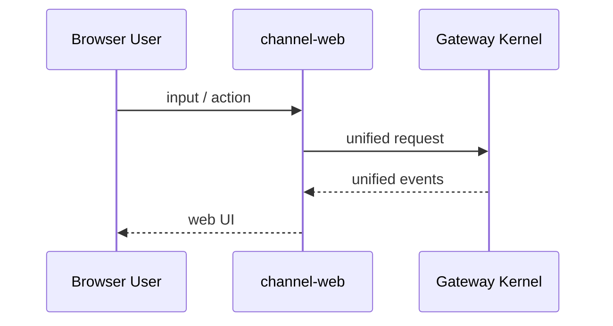

# channel-web

`web` 在 V2 里是默认优先支持的 channel，但不再是硬编码特例。

## 职责

- 浏览器输入转换为统一 request
- 接收统一 event stream
- 渲染 timeline / tool call / approval / streaming UI

## 依赖

- `kernel`
- `channel-web` 自己的 UI/render 层

## 不负责

- skill 注册
- tool 语义
- provider 选择逻辑本体
- session 真相源

## Web 链路

