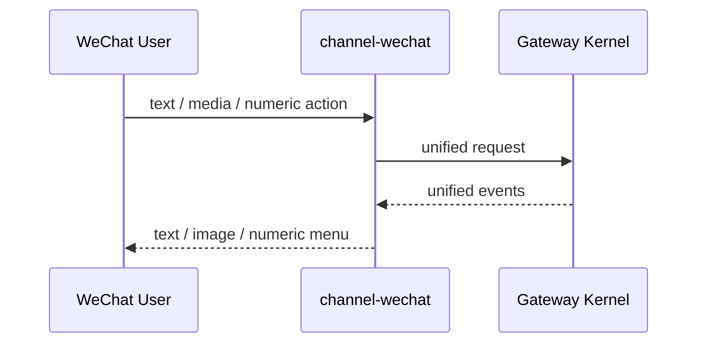

# channel-wechat

`wechat` 是可选 channel plugin，不进入主依赖闭环。

## 职责

- iLink 输入适配
- 文本 / 图片 / 进度输出适配
- 把微信特有 UX 映射到统一 contract

## 消息样式

WeChat 返回样式按 [消息样式规范](/Users/Bigo/Desktop/develop/nova-infra/codex-app/docs/architecture/channels/message-style.md) 的 Hermes low tier 执行：不展示 tool progress，不展示 reasoning / thinking，不做流式回复；只保留 typing、最终纯文本回复、数字审批和必要图片 relay。

## 特有 UX

- 文本回复
- 数字型 approval
- 图片 relay
- typing / progress 文本

## 不负责

- 不定义 approval 语义
- 不定义 skill 语义
- 不把 chatId 当作 session 真相

## WeChat 链路

