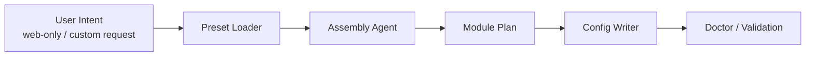

# 装配与 CLI

这份文件只回答一个问题：

**如何在同仓库模块化前提下，用 CLI + agent 去组合一套运行方案。**

CLI 的详细命令面、包结构和 JSON 约定统一见：

- [CLI 架构](/Users/Bigo/Desktop/develop/nova-infra/codex-app/docs/architecture/cli.md)

## 目标

- 同仓库模块化
- 编译期模块启用
- 配置驱动
- agent 参与组合，但不复制一套后端实现

## CLI 角色

CLI 不是第二套 server，也不是第二套 channel。

CLI 应该只做三类事：

1. `preset`
   - 读取 `web-only / wechat-only / full / custom`
2. `assemble`
   - 组合要启用的 channel 与 capability
3. `doctor`
   - 检查配置、依赖、运行前置条件

## 装配流程



## 推荐装配命令

```bash
codex-app preset list
codex-app preset show web-only
codex-app assemble apply web-only --dry-run
codex-app assemble apply custom --channels web,wechat --capabilities skills,tools,mcp --dry-run
codex-app config view
codex-app --json doctor
```

## Agent 在这里做什么

agent 最适合做：

- 根据目标场景选 preset
- 推导能力组合
- 生成 config
- 解释当前装配结果

agent 不应该做：

- 直接接管 runtime 主逻辑
- 绕过 preset 生成私有分叉
- 为某个 channel 私下发明 contract

## 推荐配置边界

```json
{
  "channels": {
    "web": { "enabled": true },
    "wechat": { "enabled": false },
    "telegram": { "enabled": false }
  },
  "capabilities": {
    "skills": { "enabled": true },
    "tools": { "enabled": true },
    "mcp": { "enabled": true },
    "storage": { "driver": "json" }
  },
  "runtime": {
    "gateway": { "transport": "ws" },
    "codex": { "transport": "app-server-ws" }
  }
}
```

CLI/agent 只应该写这三段：

- `channels`
- `capabilities`
- `runtime`

这样可以避免装配逻辑散落进 adapter、sender、poller、UI。
