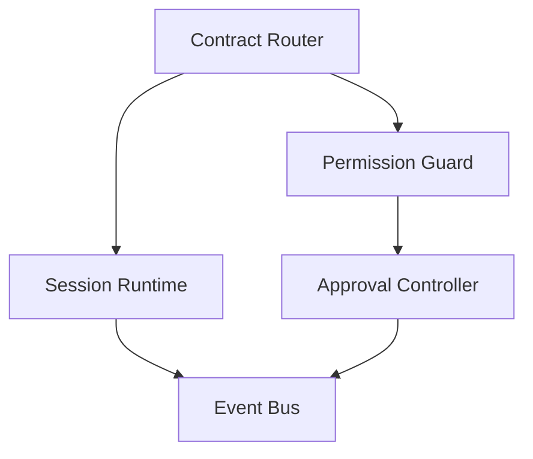

# Gateway Kernel

这份文件只描述 **必须稳定的内核**，不展开 channel 细节。

## Kernel 职责

Gateway Kernel 只做 4 件事：

1. 统一 contract
2. session ownership 与 resume/fallback
3. approval lifecycle
4. timeline / event stream

不做的事：

- 不渲染终端 UI
- 不直接承载 skill 逻辑
- 不按 channel 存业务真相
- 不复制 `codex app-server` 的能力

## Kernel 子模块



## 边界原则

### 1. Channel 不拥有 session 真相

`channel-web`、`channel-wechat`、`channel-telegram` 只能持有当前输入上下文，不能各自演化出一套 session 规则。

### 2. Kernel 不拥有 channel UX

approval 在 kernel 里是统一事件；到底是 web modal、telegram keyboard、还是微信数字菜单，由 channel 自己渲染。

### 3. Kernel 只认统一事件

统一事件建议至少包含：

- `turn.started`
- `turn.delta`
- `turn.completed`
- `tool.call.started`
- `tool.call.completed`
- `approval.requested`
- `approval.resolved`
- `session.updated`

## Session Runtime 最小模型

```ts
type SessionContext = {
  channelInstanceId: string
  subjectId: string
  threadId?: string
  workspaceId?: string
  providerId?: string
  model?: string
  reasoningEffort?: string
}
```

关键要求：

- `resume` 失败要 fresh fallback
- channel 不直接把自己的 chatId/threadId 当作 runtime 真相
- 持久化是 adapter 的职责，不是 kernel 的职责

## 为什么 Kernel 要小

因为真正需要高频变化的是：

- 入口 channel
- skill / tool / provider / storage

Kernel 一旦变大，就会再次变成当前这种“任何需求都往 adapter/server 里塞”的形态。
